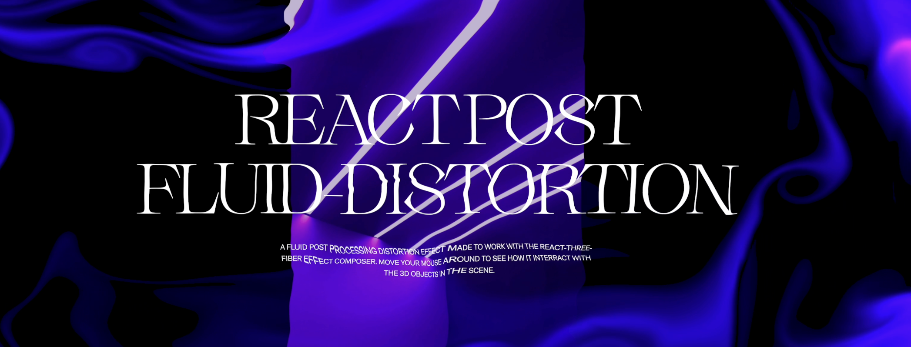

# Fluid Distortion for React Three Fiber



Post-processing for fluid distortion effect, based on the shaders developed by [Pavel Dobryakov](https://github.com/PavelDoGreat/WebGL-Fluid-Simulation) adapted to work with [React Three Fiber](https://docs.pmnd.rs/react-three-fiber/getting-started/introduction).

## Try it :

[Live preview](https://cvdt72-5173.csb.app/)

[codesandbox](https://codesandbox.io/p/github/whatisjery/react-fluid-distortion/main)

## Installation :

```bash
npm install @whatisjery/react-fluid-distortion @react-three/drei postprocessing leva
```

The required dependencies for it to work are [postprocessing](https://github.com/pmndrs/postprocessing), [drei](https://github.com/pmndrs/drei) and optionally [leva](https://github.com/pmndrs/leva) if you intend to use the `useConfig`hooks to show the debug panel.

## Usage :

```jsx
import { EffectComposer } from '@react-three/postprocessing';
import { Fluid } from '@/index';

<EffectComposer>
    <Fluid />
</EffectComposer>;
```

## Debug pannel :

Show a debug panel to test options more easily.

```jsx
import { EffectComposer } from '@react-three/postprocessing';
import { Fluid, useConfig } from '@/index';

const config = useConfig();

<EffectComposer>
    <Fluid {...config} />
</EffectComposer>;
```

## Options :

| Name                   | Type    | Default Value | Description                                                                                    |
| ---------------------- | ------- | ------------- | ---------------------------------------------------------------------------------------------- |
| `fluidColor`           | string  | `#005eff`     | Sets the fluid color. Effective only when `rainbow` is set to `false`.                         |
| `backgroundColor`      | string  | `#070410`     | Sets the background color. Effective only when `showBackground` is `true`.                     |
| `showBackground`       | boolean | `false`       | Toggles the background color's visibility. If `false` it becomes transprent.                   |
| `blend`                | number  | `5`           | Blends fluid into the scene when `showBackground` is true. Valid range: `0.00` to `10.0`.      |
| `intensity`            | number  | `10`          | Sets the fluid intensity. Valid range: `0` to `10`.                                            |
| `force`                | number  | `2`           | Multiplies the mouse velocity to increase fluid splatter. Valid range: `0.0` to `20`.          |
| `distortion`           | number  | `2`           | Sets the distortion amount. Valid range: `0.00` to `2.00`.                                     |
| `radius`               | number  | `0.3`         | Sets the fluid radius. Valid range: `0.01` to `1.00`.                                          |
| `curl`                 | number  | `10`          | Sets the amount of the curl effect. Valid range: `0.0` to `50`.                                |
| `swirl`                | number  | `20`          | Sets the amount of the swirling effect. Valid range: `0` to `20`.                              |
| `velocityDissipation`  | number  | `0.99`        | Reduces the fluid velocity over time. Valid range: `0.00` to `1.00`.                           |
| `densitionDissipation` | number  | `0.95`        | Reduces the fluid density over time. Valid range: `0.00` to `1.00`.                            |
| `pressure`             | number  | `0.80`        | Controls the reduction of pressure. Valid range: `0.00` to `1.00`.                             |
| `rainbow`              | boolean | `true`        | Activates color mode based on mouse direction. No range applicable as this is a boolean value. |
